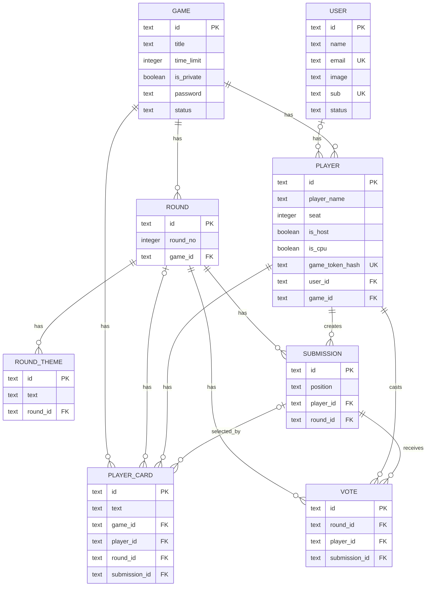

# ER図

```mermaid
erDiagram

USER {
    text id PK
    text name
    text email UK
    text image
    text sub UK
    text status
}

GAME {
    text id PK
    text title
    integer time_limit
    boolean is_private
    text password
    text status
}

PLAYER {
    text id PK
    text player_name
    integer seat
    boolean is_host
    boolean is_cpu
    text game_token_hash UK
    text user_id FK
    text game_id FK
}

PLAYER_CARD {
    text id PK
    text text
    text game_id FK
    text player_id FK
    text round_id FK
    text submission_id FK
}

ROUND {
    text id PK
    integer round_no
    text game_id FK
}

ROUND_THEME {
    text id PK
    text text
    text round_id FK
}

SUBMISSION {
    text id PK
    text position
    text player_id FK
    text round_id FK
}

VOTE {
    text id PK
    text round_id FK
    text player_id FK
    text submission_id FK
}


USER o|--o{ PLAYER : "has"

GAME ||--o{ PLAYER : "has"
GAME ||--o{ ROUND : "has"
GAME ||--o{ PLAYER_CARD : "has"

ROUND ||--o{ ROUND_THEME : "has"
ROUND ||--o{ SUBMISSION : "has"
ROUND ||--o{ VOTE : "has"
ROUND o|--o{ PLAYER_CARD : "has"

PLAYER ||--o{ PLAYER_CARD : "has"
PLAYER ||--o{ SUBMISSION : "creates"
PLAYER ||--o{ VOTE : "casts"

SUBMISSION ||--o{ VOTE : "receives"
SUBMISSION o|--o{ PLAYER_CARD : "selected_by"
```