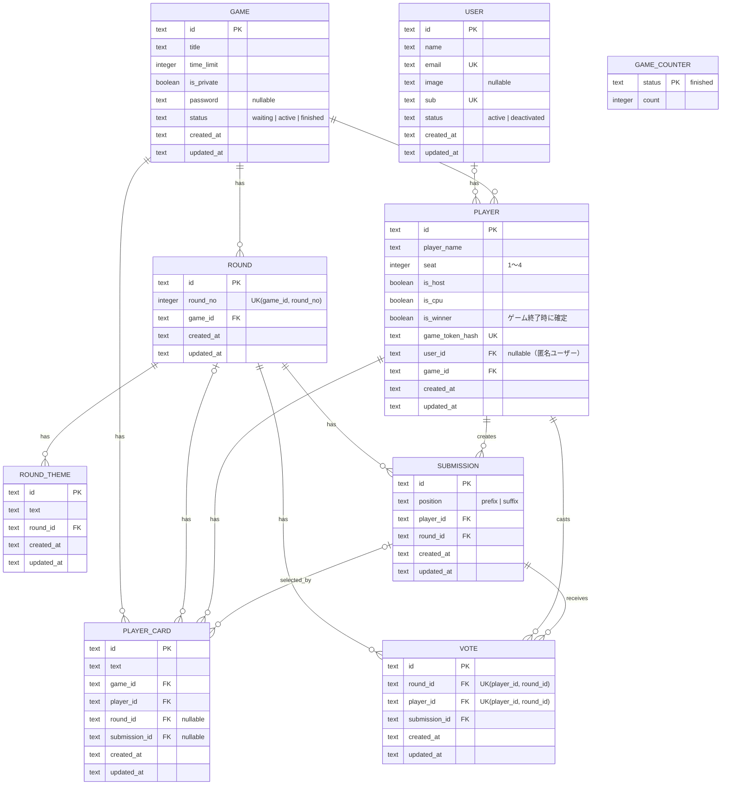

# ER図

```mermaid
erDiagram

USER {
    text id PK
    text name
    text email UK
    text image "nullable"
    text sub UK
    text status "active | deactivated"
    text created_at
    text updated_at
}

GAME {
    text id PK
    text title
    integer time_limit
    boolean is_private
    text password "nullable"
    text status "waiting | active | finished"
    text created_at
    text updated_at
}

GAME_COUNTER {
    text status PK "finished"
    integer count
}

PLAYER {
    text id PK
    text player_name
    integer seat "1〜4"
    boolean is_host
    boolean is_cpu
    boolean is_winner "ゲーム終了時に確定"
    text game_token_hash UK
    text user_id FK "nullable（匿名ユーザー）"
    text game_id FK
    text created_at
    text updated_at
}

PLAYER_CARD {
    text id PK
    text text
    text game_id FK
    text player_id FK
    text round_id FK "nullable"
    text submission_id FK "nullable"
    text created_at
    text updated_at
}

ROUND {
    text id PK
    integer round_no "UK(game_id, round_no)"
    text game_id FK
    text created_at
    text updated_at
}

ROUND_THEME {
    text id PK
    text text
    text round_id FK
    text created_at
    text updated_at
}

SUBMISSION {
    text id PK
    text position "prefix | suffix"
    text player_id FK
    text round_id FK
    text created_at
    text updated_at
}

VOTE {
    text id PK
    text round_id FK "UK(player_id, round_id)"
    text player_id FK "UK(player_id, round_id)"
    text submission_id FK
    text created_at
    text updated_at
}


USER o|--o{ PLAYER : "has"

GAME ||--o{ PLAYER : "has"
GAME ||--o{ ROUND : "has"
GAME ||--o{ PLAYER_CARD : "has"

ROUND ||--o{ ROUND_THEME : "has"
ROUND ||--o{ SUBMISSION : "has"
ROUND ||--o{ VOTE : "has"
ROUND o|--o{ PLAYER_CARD : "has"

PLAYER ||--o{ PLAYER_CARD : "has"
PLAYER ||--o{ SUBMISSION : "creates"
PLAYER ||--o{ VOTE : "casts"

SUBMISSION ||--o{ VOTE : "receives"
SUBMISSION o|--o{ PLAYER_CARD : "selected_by"
```
